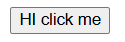

# modUi
A premium UI kit/library built for React with Tailwind CSS and Lucide React. Designed for repacing the old html components with awesome, new, modern and aesthetic components.

| Default HTML components | Default ModUi components |
| ----------------------- | ------------------------ |
|  | 

## Features:
### Add components with ease
- With the cli command install any component from thee library just by writing less than 1 line of code
### Fully customizable
- The components already come with various variants. If you still need to customize more, the code is open source in your components/ui folder.
### Easy code structure
- The code is very easy to understand and easy to use.
### Modernized UI
- All the components are built mainly for modern ui by eradicate the old looking default html components

## Quick start
- Get started on your next.js project with our components with ease
### Create next app (skip this if you already have a next app set up):
```npx create-next-app@latest --yes```
### Add any component (this shows how to install a button component):
```npx modui-uikit@latest add button```

## Available components
- Accordion
- Badge
- Button
- Callout
- Card
- Codeblock
- Input
- Link 
- and many more!